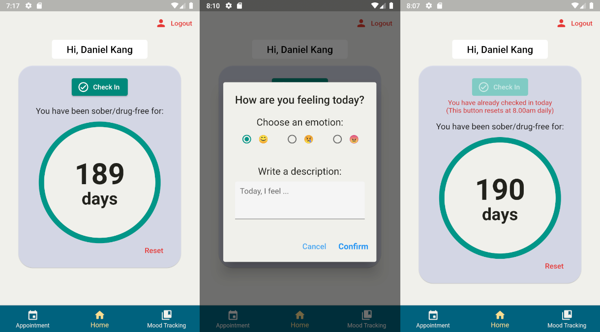
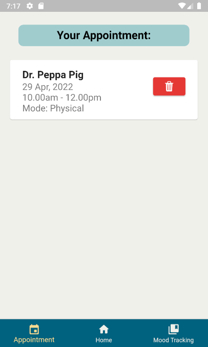
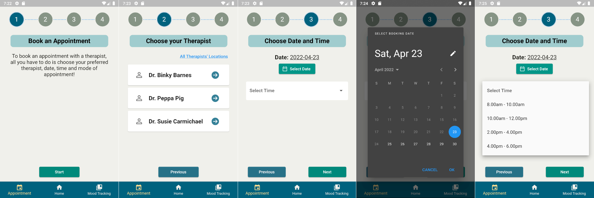
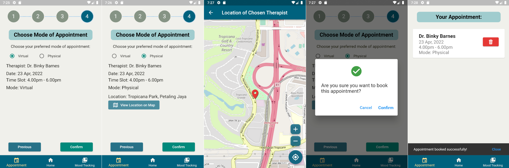
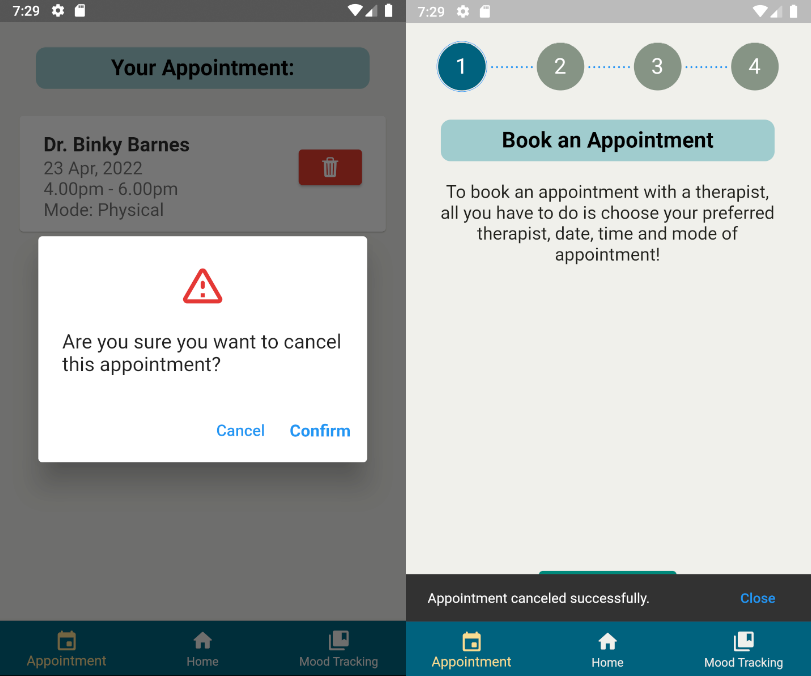
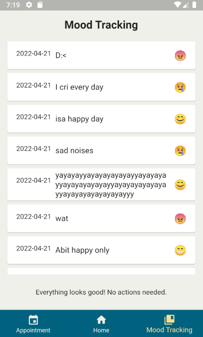
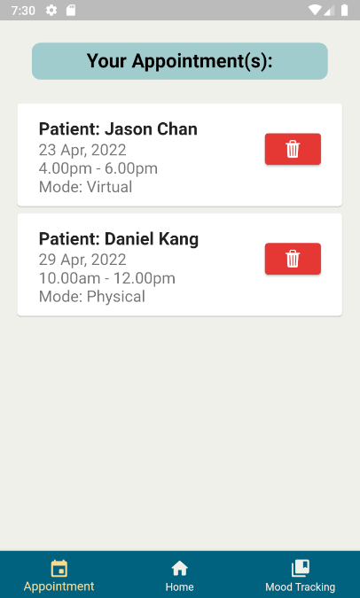
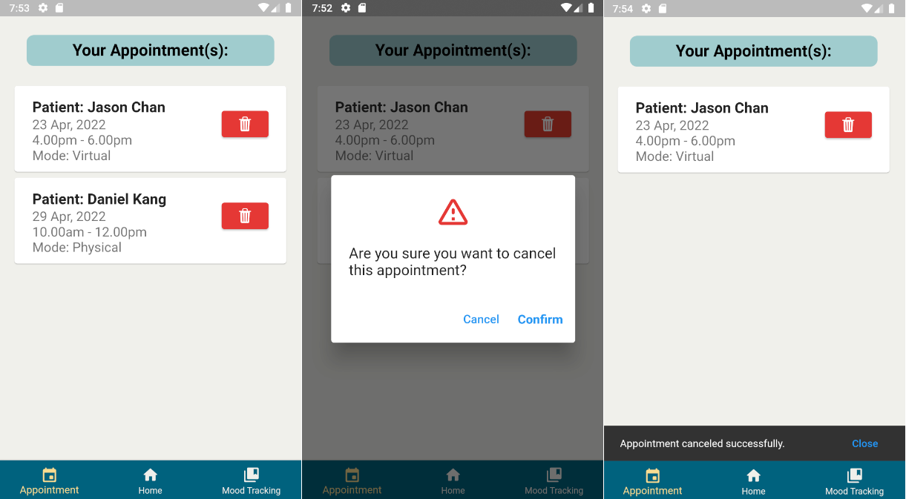

# Drug Addiction Recovery Management System

A mobile application built on Flutter with Firebase's Cloud Firestore and Authentication.

 

## Patient Module

### Home

### Appointment List

### Appointment Booking

### Cancel Appointment

### Mood Tracking

 

## Therapist Module

### Appointment List

### Cancel Appointment
